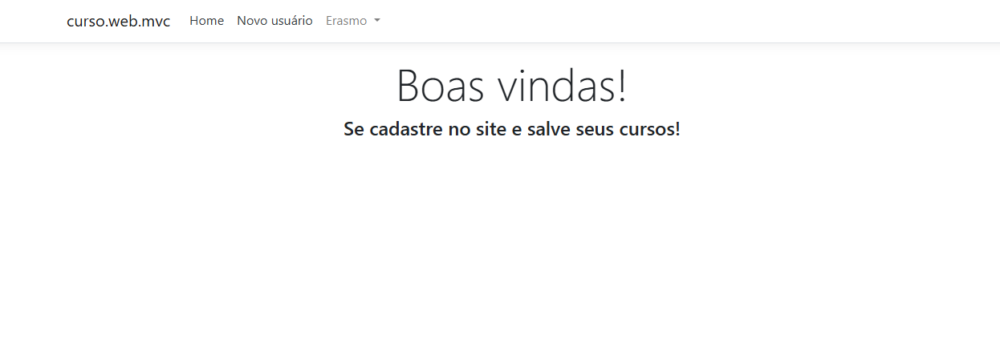

# 💻 WebAPI e MVC (curso)

Este repositório contém um agrupamento de projetos .NET para estudo e demonstração: uma Web API (`curso.api`), uma aplicação MVC (`curso.web.mvc`) que consome a API, e um projeto de testes (`tests/curso.api.tests`).  

## 🧭 Visão geral

- `curso.api/` — projeto ASP.NET Core Web API que expõe endpoints para recursos de curso e usuário.  
- `curso.web.mvc/` — aplicação ASP.NET Core MVC que consome a API e fornece uma interface web.  
- `tests/curso.api.tests/` — testes unitários/integrados para a API.  

O objetivo deste repositório é oferecer um exemplo completo de arquitetura de aplicação web em .NET com separação entre API, front-end server-side (MVC) e testes.

## 🗂️ Estrutura do repositório

Raiz do repositório (resumo):

- `curso.api/` — fonte da API (Program.cs, Startup.cs, Controllers, Business, Infraestrutura, Migrations, appsettings.*)  
- `curso.web.mvc/` — aplicação MVC (Program.cs, Startup.cs, Controllers, Views, wwwroot)  
- `tests/curso.api.tests/` — projeto de testes  
- `curso.sln` — solução que agrupa os projetos  

## ⚙️ Pré-requisitos

- .NET SDK 8.0 (versão compatível com os projetos — ver `TargetFramework` nos `.csproj`)  
- (Opcional) Visual Studio 2019/2022 ou VS Code  
- SQL Server  
- dotnet-ef (aplicar migrations manualmente): `dotnet tool install --global dotnet-ef`  

## 🛠️ Configuração

As configurações principais ficam em `appsettings.json` e `appsettings.Development.json` dentro de cada projeto. Antes de rodar a aplicação localmente, verifique:

- `ConnectionStrings` — configure a string de conexão com o banco de dados.  
- Configurações de JWT (se aplicável) — segredos e parâmetros de expiração.  

## 🚀 Executando localmente

Recomendações para executar os serviços na linha de comando (PowerShell):

1) Restaurar pacotes e compilar a solução

```powershell
dotnet restore 
dotnet build
```

2) Aplicar essas migrations e criar as tabelas no SQL Server  

```powershell
dotnet ef database update
```

3) Executar os testes  

```powershell
dotnet test .\tests\curso.api.tests\curso.api.tests.csproj
```

4) Rodar a API (`curso.api`)  

```powershell
dotnet watch run .\curso.api\curso.api.csproj
```

5) Rodar a aplicação MVC (`curso.web.mvc`) 

```powershell
dotnet watch run --project .\curso.web.mvc\curso.web.mvc.csproj
```

6) O navegador abrirá automaticamente na página da aplicação em execução: 



## 🤝 Como contribuir

1. Crie uma branch com nome descritivo: `feature/minha-mudanca`.  
2. Faça commits pequenos e claros.  
3. Abra Pull Request descrevendo o que foi alterado e por quê.  

---

🙏 Agradeço profundamente à **Digital Innovation One** por proporcionar este aprendizado gratuito e de qualidade. Um reconhecimento especial ao professor **[Leonardo Buta](https://www.linkedin.com/in/leonardo-buta/)** pela excelente didática e orientação durante todo o processo.

<div align="center">
  <p>⭐ Se este projeto foi útil para você, considere dar uma estrela!</p>
</div>
